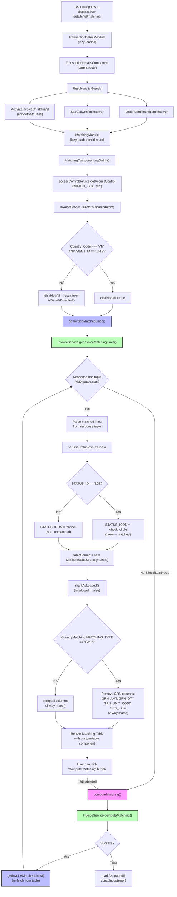

```mermaid
flowchart TD
    A["User navigates to<br/>/transaction-details/:id/matching"] --> B["TransactionDetailsModule<br/>(lazy-loaded)"]
    B --> C["TransactionDetailsComponent<br/>(parent route)"]
    C --> D["Resolvers & Guards"]
    D --> D1["LoadFormRestrictionResolver"]
    D --> D2["SapCallConfigResolver"]
    D --> D3["ActivateInvoiceChildGuard<br/>(canActivateChild)"]
    D1 & D2 & D3 --> E["MatchingModule<br/>(lazy-loaded child route)"]

    E --> F["MatchingComponent.ngOnInit()"]

    F --> G["accessControlService.getAccessControl<br/>('MATCH_TAB', 'tab')"]
    G --> H["InvoiceService.isDetailsDisabled(item)"]
    H --> I{"Country_Code === 'VN'<br/>AND Status_ID == '1513'?"}
    I -->|Yes| J["disabledAll = true"]
    I -->|No| K["disabledAll = result from<br/>isDetailsDisabled()"]

    J & K --> L["getInvoiceMatchedLines()"]

    L --> M["InvoiceService.getInvoiceMatchingLines()"]
    M --> N{"Response has tuple<br/>AND data exists?"}

    N -->|No & intialLoad=true| O["computeMatching()"]
    N -->|Yes| P["Parse matched lines<br/>from response.tuple"]

    O --> Q["InvoiceService.computeMatching()"]
    Q --> R{"Success?"}
    R -->|Yes| L2["getInvoiceMatchedLines()<br/>(re-fetch from table)"]
    R -->|Error| S2["markAsLoaded()<br/>console.log(error)"]

    P --> T["setLineStatusIcon(mLines)"]
    T --> U{"STATUS_ID == '105'?"}
    U -->|Yes| V["STATUS_ICON = 'check_circle'<br/>(green - matched)"]
    U -->|No| W["STATUS_ICON = 'cancel'<br/>(red - unmatched)"]
    V & W --> X["tableSource = new MatTableDataSource(mLines)"]

    L2 --> N

    X --> Y["markAsLoaded()<br/>(intialLoad = false)"]

    Y --> Z{"CountryMatching.MATCHING_TYPE<br/>== 'TWO'?"}
    Z -->|Yes| AA["Remove GRN columns:<br/>GRN_AMT, GRN_QTY,<br/>GRN_UNIT_COST, GRN_UOM<br/>(2-way match)"]
    Z -->|No| AB["Keep all columns<br/>(3-way match)"]

    AA & AB --> AC["Render Matching Table<br/>with custom-table component"]

    AC --> AD["User can click<br/>'Compute Matching' button"]
    AD -->|If !disabledAll| O

    style O fill:#f9f,stroke:#333,stroke-width:2px
    style L fill:#bbf,stroke:#333,stroke-width:2px
    style L2 fill:#bbf,stroke:#333,stroke-width:2px
    style M fill:#bfb,stroke:#333,stroke-width:2px
    style Q fill:#bfb,stroke:#333,stroke-width:2px
```
