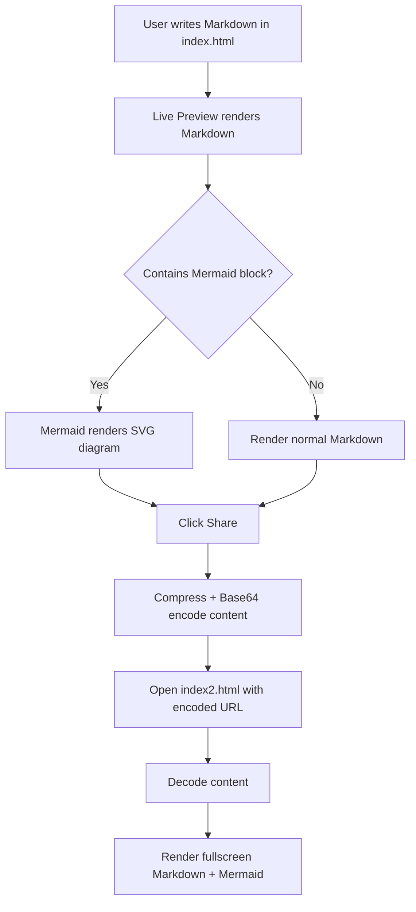

Got it — you want a **Markdown (`.md`) file** that explains the project/functionality and includes a **Mermaid flowchart diagram** inside the Markdown file.

## Goal

Create a `.md` documentation file, likely something like `README.md`, that explains:

- What `index.html` does
- What `index2.html` does
- How Markdown + Mermaid rendering works
- How the Share URL/base64 flow works
- How to use Mermaid diagrams inside Markdown

## Mermaid flowchart to include

The `.md` file will include a fenced Mermaid block like this:

````md

````

## Proposed deliverable

I will create a file named:

```text
README.md
```

It will contain:

1. Project title
2. Feature explanation
3. Usage instructions
4. Share URL explanation
5. Mermaid flowchart diagram
6. Example Markdown + Mermaid syntax

Please **toggle to Act mode** and I’ll create the `.md` file.
"# md" 
